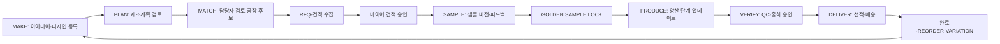

# KERYX 제조실행 플랫폼: 최종 사업 방향 및 통합 개편 실행계획

**작성일:** 2026-08-31
**작성자:** Manus AI
**대상:** KERYX 경영·기획·개발·운영팀
**문서 성격:** 기존 Production 기능과 데이터를 보존하는 승인용 설계·개발 범위 문서

---

## 1. 결론: KERYX의 최종 사업 방향

KERYX의 최종 방향은 **공개형 공장 검색·최저가 경쟁 플랫폼**도 아니고, 단순 주문제작 쇼핑몰도 아닙니다. KERYX는 초기에는 **봉제·소프트 굿즈 중심의 제조실행 플랫폼**으로 집중해야 합니다. 바이어가 아이디어 또는 디자인을 등록하면 KERYX가 제조계획, 공장 선별, 견적, 샘플 수정, 골든샘플 확정, 양산, QC, 물류, 재주문까지 하나의 제조 프로젝트로 관리하는 구조입니다.[1]

> **핵심 가치 제안:** 바이어는 제품의 사업적 의사결정에 집중하고, KERYX는 중국 제조 실행과 기록 관리를 책임집니다.

기존에 배포된 **자체 디자인 IP, 스토어, 샘플 구독, 회사소개**는 폐기 대상이 아닙니다. 이들은 제조실행 플랫폼의 신뢰와 유입을 만드는 **공개 접점**으로 유지합니다. 다만 로그인 이후 바이어의 중심 경험은 상품 카탈로그나 공장 검색이 아니라 **내 제조 프로젝트**가 되어야 합니다. 즉, 공개 사이트는 `브랜드·IP·상품 사례·유입`을 담당하고, B2B 포털은 `제조 실행·승인·기록·재주문`을 담당하는 이중 구조가 최적입니다.

| 구분 | 최종 역할 | 유지·개편 원칙 |
|---|---|---|
| 공개 웹 | KERYX의 브랜드, 자체 IP, 실제 판매 상품, 제조 가능 범위, 샘플 구독, 신규 제조 문의 | 기존 `/ip`, `/shop`, `/sample-subscription`, `/about`는 유지하고 제조실행 진입점을 추가 |
| 바이어 포털 | 내 프로젝트, 견적·샘플·양산·QC·배송 승인, 재주문, 제조 자산 | 카탈로그 중심의 기존 `/seller`는 신규 `/buyer`와 병행 후 단계 전환 |
| 내부 운영 | 신규 프로젝트, 예외, 리스크, 수익성, 공장·바이어 성과, 승인 | 기존 `/admin`, `/md` 기능을 재사용하며 프로젝트 중심 작업대 추가 |
| 공장 포털 | 배정 RFQ, 자기 견적, 샘플, 생산 진척, 출하, 생산능력, 신상품 | 다른 공장·바이어·KERYX 마진은 보이지 않도록 데이터 레이어부터 차단 |
| 데이터 자산 | 사양, 부품·원단, 샘플 버전, 납기, 불량, 공장 적합도, 재주문 결과 | 고객 원본 디자인과 분리해 익명 제조 메타데이터만 축적 |

이 방향은 첨부 계획서의 **“바이어의 외부 상품개발팀 + 외부 제조팀 + 중국 생산관리팀 + 제조 데이터를 가진 소프트웨어”**라는 정의를 그대로 실현하면서도, 현재 이미 배포된 IP·스토어·운영자 콘솔 투자를 버리지 않는 방식입니다.[1]

---

## 2. 확인된 현재 상태와 전환 필요성

### 2.1 확인된 사실

현재 Production 공개 홈은 자체 IP·캐릭터 상품·스토어·샘플 구독을 중심으로 구성되어 있으며, `자체 디자인 IP 보기`와 `스토어 보기`가 핵심 행동으로 배치되어 있습니다. 상품은 소개용 IP 굿즈와 실제 판매 상품을 구분하는 구조이고, 공개 영역의 기본 축은 이미 안정화되어 있습니다.[2]

기존 바이어 포털은 `매칭 공장 상품`, `견적·주문`, `공장 매칭`, `MD 소통`, `통관·운송`을 중심으로 설계돼 있습니다. 현재는 하나의 제품을 아이디어부터 골든샘플·양산·QC·재주문까지 연결하는 독립 **프로젝트 룸**이 없습니다.[3] 내부 MD 화면 역시 시장조사·샘플제작·공장매칭의 개별 서비스 큐를 중심으로 동작하므로, 제조 단계와 예외를 한 화면에서 관리하는 모델과는 차이가 있습니다.[4]

관리자 영역에는 IP·상품·공장·가격·주문·샘플·검수·메일링·운영 이력 기능이 이미 존재합니다. 그러나 관리자 홈과 메뉴가 여러 독립 도구를 병렬로 보여주는 형태여서, `신규 프로젝트 → 견적 → 샘플 → 양산 → QC → 출하`의 단일 제조 흐름으로 재배치해야 합니다.[5]

### 2.2 현재 구조에서 보존할 자산

기존 데이터나 화면을 삭제하거나 신규 테이블로 덮어써서는 안 됩니다. 아래 자산은 신규 제조실행 모델에서 **연결·참조·점진 전환**해야 합니다.

| 기존 자산 | 신규 모델에서의 활용 | 전환 방식 |
|---|---|---|
| `products`, `product_categories`, 상품 옵션 | 프로젝트에서 참고 상품·재주문 원형·자체 IP 상품으로 참조 | 기존 상품 ID를 선택적으로 참조하고 제조 전용 사양은 별도 버전 테이블에 저장 |
| `factory_matching_requests`, 매칭 보고서 | 신규 프로젝트의 초기 문의·매칭 이력 | 과거 요청은 읽기 전용 보관, 신규 프로젝트용 RFQ·후보 구조는 별도 생성 |
| `quote_requests`, 주문, 결제 | 상업 견적·주문·청구의 기존 이력 | 새 프로젝트 견적 스냅샷과 연결 키를 추가하고 과거 레코드는 수정하지 않음 |
| `sample_requests`, 검사·검수 데이터 | 샘플/검수 이력과 첨부 파일 기반 | 신규 `sample_versions`, `qc_inspections`와 병행 사용 후 점진 매핑 |
| `conversations`, `messages`, 첨부 파일 | 프로젝트 단계별 소통의 기반 | 새 `project_messages`가 기존 대화 ID를 참조할 수 있게 연결 |
| `b2b_subscribers`, 주간 안내, IP/스토어 | 신규 제조 아이디어 유입과 재방문 | 샘플 구독과 유료·계약 기반 제조 서비스를 절대 혼동하지 않음 |
| 운영 이력, 가격 승인 워크플로 | 관리자 감사·고위험 변경 통제 | 새 제조 이벤트·승인 로그에도 동일한 불변 기록 원칙 적용 |

### 2.3 반드시 개선할 구조적 차이

| 현재 관찰 | 제조실행 플랫폼의 목표 | 최종 수정 원칙 |
|---|---|---|
| 바이어가 카탈로그·매칭 공장·주문을 개별 화면에서 처리 | 하나의 제품마다 하나의 프로젝트 룸 | 신규 `/buyer/projects/[projectId]`를 제조의 단일 진실 화면으로 구현 |
| 공장 매칭 데이터가 견적·샘플·양산 기록과 느슨하게 연결 | 공장 후보·RFQ·견적·선정 근거가 프로젝트 안에 보존 | 매칭 결과를 프로젝트 RFQ와 후보 테이블로 고정하고 변경 이력 기록 |
| 가격·MOQ·납기 정보가 요청·상품·주문에 흩어질 수 있음 | 견적 승인 시점의 가격·조건이 불변 스냅샷 | 견적·골든샘플·출하마다 스냅샷 테이블을 사용 |
| MD 화면은 서비스 유형별 처리 화면 | 직원은 오늘 처리할 제조 예외를 보는 화면 | `/md/manufacturing`의 우선순위 큐와 프로젝트 작업대로 통합 |
| 공장 포털은 상품 등록·브리프·주문 중심 | 공장은 배정된 RFQ와 자기 제조 실행만 관리 | 공장별 RFQ·견적·샘플·생산·출하·캐파를 프로젝트 기준으로 표시 |
| `sitemap.yaml`은 실제 최근 공개·운영 경로를 완전 반영하지 못함 | 모든 새 주소, 권한, 데이터, API의 단일 목록 | Sitemap v3로 승격하고 PR마다 검증·변경 보고 의무화 |

---

## 3. 확정 운영 원칙

### 3.1 시장과 고객의 범위

첫 출시 범위는 봉제인형, 봉제키링, 쿠션, 바디필로우, 파우치, 봉제가방, 캐릭터 슬리퍼, 봉제 액세서리, 패브릭 굿즈, 종이택·패키지, 관련 부자재로 한정합니다. PVC, 아크릴, 사출, 판촉상품, 통관 자동화, 재고관리 등은 제조 데이터와 운영 프로세스가 축적된 뒤 확장하는 후속 범위입니다.[1]

초기 우선 고객은 다수의 불특정 회원이 아니라 **반복 제조 가능성이 높은 핵심 바이어**와 각 전문성이 명확한 검증 공장입니다. 공장 수를 많이 늘리는 것보다 카테고리별 샘플 정확도, 납기, 불량, 소통, 재주문 성과를 실제 결과로 축적하는 것이 우선입니다.

### 3.1.1 공개 메시지와 브랜드 표기 구분

현재 홈의 `스토리가 있는 제품을 기획하여 공급합니다`는 공개 유입을 위한 **캠페인 메시지**로 유지할 수 있습니다. 다만 회사소개·브랜드 소개·로고 소개에서는 KERYX 표기와 승인된 브랜드 유래를 일관되게 사용해야 하며, 공장·중국어 내부 운영 화면에는 중국 측 법인 정보나 구매자용 법인 정보를 노출하지 않습니다. 공개 B2B 제조실행 페이지에서는 과장된 성과 수치 대신 `아이디어부터 샘플·양산·QC·납품까지 프로젝트로 관리한다`는 검증 가능한 운영 방식으로 신뢰를 설명합니다.

### 3.2 공장 경쟁입찰 금지와 사람 최종 결정

AI나 규칙 엔진은 제품 사양·수량·납기·원단·공장 이력에 따라 후보를 정렬할 수 있습니다. 그러나 시스템이 공장을 자동 확정하거나 바이어에게 모든 공장 연락처를 공개해서는 안 됩니다. 반드시 **후보 분석 → 담당자 검토 → 바이어 승인**의 단계를 거칩니다. 공장은 다른 공장의 견적, 바이어가 보는 판매가, KERYX의 마진을 볼 수 없습니다.[1][6]

### 3.3 디자인 보호와 데이터 자산의 분리

바이어의 원본 디자인, 도면, 캐릭터 IP, 제품 사진, 수정 지시는 `Private Project Data`로 분리합니다. 다른 바이어·공장·신상품 추천·AI 생성에 재사용하지 않습니다. 대신 제품 카테고리, 크기 구간, 원단 속성, 부품 수, 자수 난이도, MOQ, 샘플 버전 수, 생산기간, 불량 유형, 납기 성과처럼 개인·IP를 식별하지 않는 제조 메타데이터만 집계해 벤치마크와 공장 적합도에 사용합니다.[1]

### 3.4 수치의 사용 원칙

첨부 계획서의 가격, 수량, 비율, 점수는 **UI 구조를 설명하기 위한 예시**이며 Production의 기본값이나 공개 광고문구로 넣지 않습니다. 공개 화면에는 검증되지 않은 납기율·불량률·거래액·공장 수·가격을 넣지 않습니다. 실제 데이터가 축적된 뒤에도 바이어에게는 본인 프로젝트 또는 익명·집계된 비교 데이터만 제공하고, 표본 부족 시 `데이터 축적 중`으로 정확히 표시합니다.

---

## 4. 최종 제조 워크플로우

아래 상태 흐름은 시스템의 핵심입니다. 화면에 버튼을 많이 만드는 것보다, 허용된 상태 전이와 승인 조건을 DB에서 강제하는 것이 우선입니다.



| 단계 | 바이어 경험 | 내부·공장 처리 | 시스템이 강제할 조건 |
|---|---|---|---|
| MAKE | 이미지, 참고 사진, 글 설명, 기존 프로젝트 복제 중 한 방식 선택 | 신규 프로젝트 접수, 담당자 배정 | 최소 제품 정보와 첨부 소유권 확인 |
| PLAN | 예상 제품 형태, MOQ 범위, 예상 기간, 주요 리스크를 읽고 보완 | 사양 정리, 카테고리/원단/난이도 태깅 | AI 결과는 `초안`이며 담당자 검토 전 외부 확정 금지 |
| MATCH | 검증된 선택지와 추천 사유만 확인 | 적합 공장 후보, 캐파, 과거 성과 검토 | 자동 확정 금지, 공장별 정보·견적 격리 |
| QUOTATION | KERYX 기준의 제품·검수·물류 조건을 명확히 확인 | 공장 견적 비교, KERYX 견적 작성, 승인 요청 | 가격·MOQ·납기·물류·검수 항목 승인 스냅샷 생성 |
| SAMPLE | V1~최종 샘플을 비교하고 쉬운 피드백 또는 상세 주석 작성 | 공장 요청 번역, 변경 지시, 버전 관리 | 원본 이미지는 보존, 피드백·수정 요청은 추적 가능 |
| GOLDEN LOCK | 최종 기준 사양을 확인하고 승인 | 양산 기준서 확정 | 승인 후 변경은 새 변경주문·새 버전으로만 가능 |
| PRODUCE | 단계별 진행률, 사진·영상, 다음 행동만 확인 | 생산 업데이트, 지연·이슈 대응 | 진행률은 공장 업데이트와 담당자 확인 이력 보유 |
| VERIFY | PASS/보류, 핵심 수량·결함·사진을 먼저 확인 | QC 기록, 결함 조치, 출하 승인 요청 | QC 보류·중대 결함 시 출하 상태 전환 차단 |
| DELIVER | 선적·배송 상태와 문서를 확인 | 출하·물류 일정·통관 자료 관리 | 출하 전 금액·수량·QC·문서 조건 검증 |
| REORDER | 기존 사양을 불러와 수량·희망일만 수정 | 캐파·원가·납기 재검토 | 기존 골든샘플/사양을 참조하되 신규 프로젝트 생성 |

---

## 5. 데이터·권한·API 프로그래밍 최종 설계

### 5.1 마이그레이션 원칙

새 핵심 테이블은 모두 `manufacturing_` 접두어를 사용합니다. 기존 `orders`, `products`, `sample_requests`, `factory_matching_requests`를 변경하거나 삭제하지 않습니다. 신규 테이블은 기존 레코드의 ID를 **선택적 참조 키**로만 보관합니다. 따라서 이전 B2B 주문·가격 승인·소매 주문·IP 데이터의 동작을 보존할 수 있습니다.

또한 가격, 사양, 골든샘플, QC, 출하, 결제처럼 되돌리기 어려운 데이터는 수정형 한 행이 아니라 **버전·스냅샷·이력 행**으로 보관합니다. 모든 테이블의 RLS, 상태 전이 함수, 인덱스, 운영 이력 기록을 포함한 SQL을 먼저 PR로 제시하고, 대표 승인 후에만 Supabase SQL Editor 적용 또는 마이그레이션 배포를 진행합니다.[6]

### 5.2 신규 핵심 테이블

| 도메인 | 신규 테이블 | 핵심 역할 | 기존 데이터와 연결 |
|---|---|---|---|
| 프로젝트 | `manufacturing_projects`, `manufacturing_project_members`, `manufacturing_project_events` | 프로젝트 번호, 단계, 담당자, 다음 행동, 이벤트 로그 | `seller_id`, 기존 주문·매칭·견적 ID의 선택 참조 |
| 제품·사양 | `manufacturing_product_specs`, `manufacturing_spec_versions`, `manufacturing_parts`, `manufacturing_materials`, `manufacturing_assets` | 제품 구조, 치수, 원단, 부자재, BOM, 도면·파일 버전 | 기존 `products`는 참고/재주문 원형으로만 참조 |
| RFQ·견적 | `manufacturing_rfqs`, `manufacturing_rfq_factories`, `manufacturing_factory_quotes`, `manufacturing_quote_snapshots`, `manufacturing_quote_approvals` | 배정 공장별 견적, 바이어용 제안가, 승인 이력 | 기존 매칭 보고서·견적 요청의 과거 이력 참조 |
| 샘플 | `manufacturing_samples`, `manufacturing_sample_versions`, `manufacturing_sample_annotations`, `manufacturing_sample_feedback` | 샘플 V1~최종 이미지, 주석, 쉬운 피드백, 공장 대응 | 기존 `sample_requests`와 연결 가능 |
| 골든샘플 | `manufacturing_golden_samples`, `manufacturing_golden_spec_snapshots`, `manufacturing_change_orders` | 양산 기준 잠금과 이후 변경 주문 | 최종 사양·BOM·포장·허용오차의 불변 스냅샷 |
| 양산 | `manufacturing_production_runs`, `manufacturing_milestones`, `manufacturing_progress_updates`, `manufacturing_capacity_slots` | 생산 회차, 공정별 진행, 사진, 지연, 공장 캐파 | 기존 주문 ID·공장 ID 참조 |
| QC·배송 | `manufacturing_qc_plans`, `manufacturing_qc_inspections`, `manufacturing_qc_defects`, `manufacturing_shipments`, `manufacturing_shipping_documents` | 검수 결과, 결함, 출하 차단, 선적·물류 문서 | 기존 `inspections`·`inspection_photos`와 병행 연결 |
| 과금·정산 | `manufacturing_payment_schedules`, `manufacturing_cost_snapshots`, `manufacturing_margin_snapshots` | 계약·청구 단계, 내부 원가·마진의 시점별 기록 | 기존 `orders`, `payments`를 참조하되 비용 데이터는 별도 격리 |
| 업무·리스크 | `manufacturing_tasks`, `manufacturing_risks`, `manufacturing_issue_threads` | 다음 행동, 담당자, 마감, 위험 수준, 해결 이력 | 기존 알림·메일·메시지 연결 |
| 발견·수요 | `product_requests`, `factory_new_offerings`, `factory_offering_reviews`, `buyer_saved_ideas`, `manufacturing_demand_signals` | 요청상품, 공장 신상품, 승인, 관심 저장, 익명 수요 집계 | 기존 구독자·메일링·카테고리 연결 |
| 분석 | `manufacturing_benchmarks`, `factory_capability_snapshots`, `buyer_project_metrics` | 익명 집계, 공장 적합도, 프로젝트 성과 | 원본 디자인을 제외한 비식별 결과만 사용 |

### 5.3 데이터 무결성 규칙

| 위험 | DB 수준의 방지 장치 |
|---|---|
| 바이어에게 공장 원가·마진 노출 | 공장 원가와 KERYX 마진은 `manufacturing_cost_snapshots`로 분리, 바이어 API는 안전한 뷰만 조회 |
| 공장에게 다른 공장·바이어·KERYX 판매가 노출 | `manufacturing_rfq_factories`와 견적 행을 공장 ID 단위 RLS로 격리, 자신의 배정 RFQ와 자신의 제출값만 허용 |
| 본인이 만든 견적·가격을 본인이 승인 | 고위험 승인 테이블에 `requested_by != approved_by` 제약과 owner 승인 단계 적용 |
| 골든샘플 확정 후 사양이 조용히 변경 | 골든샘플 스냅샷은 UPDATE/DELETE 금지, 변경은 `manufacturing_change_orders` 승인 후 새 버전 생성 |
| QC 보류인데 출하 | 출하 상태 변경 RPC가 QC 통과·수량 확인·필수 파일 조건을 트랜잭션으로 확인 |
| 납품 수량 불일치 | 주문 종료 시 `주문 + 추가 - 반품 - 클레임 = 납품` 정합성 함수를 통과해야 함 |
| 관계 변경 책임 불명 | 담당 직원·공장 배정 변경은 `manufacturing_project_events` 및 관계 이력에 행 추가만 허용 |
| 대량 목록 로딩으로 운영 화면 지연 | 상태·담당자·마감·생성일 복합 인덱스, cursor 기반 페이지네이션, 요약 뷰 사용 |

### 5.4 권한 모델: 현재 계정을 보존하는 전환 방식

현재 운영 중인 `user_profiles.kind`의 `admin`, `md`, `seller`, `factory`, `inspector` 체계는 유지합니다. 데이터 마이그레이션 초기에 역할 값을 일괄 변경하지 않습니다. 화면 표시는 사업 언어에 맞게 바꾸되, 권한은 새 프로젝트 멤버십과 업무 범위 테이블로 세분화합니다.

| 표시 역할 | 현재 계정 기반 | 허용 범위 |
|---|---|---|
| 총책임자 | `admin` | 전체 프로젝트, 원가·마진, 권한, 고위험 승인, 감사·리스크·수익성 |
| 제조 담당 직원 | `md` | 배정 프로젝트의 계획·RFQ·견적·샘플·양산·바이어 소통 |
| QC·물류 담당 | `inspector` 또는 범위가 부여된 내부 사용자 | 배정 프로젝트의 QC·출하·물류 업데이트, 가격·마진 비공개 |
| 바이어 | `seller` | 본인 회사의 프로젝트·승인·첨부·견적·샘플·배송·재주문 |
| 공장 | `factory` | 배정 RFQ, 자기 견적·샘플·생산·출하·캐파·신상품 |

모든 권한은 UI의 숨김 처리만으로 해결하지 않습니다. RLS와 서버의 권한 확인이 동시에 적용되어야 하며, 관리자·MD·QC·공장·바이어의 API 응답 필드도 서로 분리합니다. 개인정보는 마스킹이 기본이고, 필요한 원문 열람은 목적·대상·열람자·시각을 감사 로그에 남깁니다.[7]

### 5.5 API 경계

새 기능은 `/api/manufacturing/*` 아래에 일관되게 둡니다. 클라이언트는 핵심 테이블에 직접 INSERT/UPDATE하지 않고, 서버 API 또는 승인된 RPC를 통해서만 상태를 바꿉니다.

| API 그룹 | 예시 경로 | 필수 검증 |
|---|---|---|
| 프로젝트 | `GET/POST /api/manufacturing/projects`, `GET/PATCH /api/manufacturing/projects/[id]` | 소유·배정 권한, 단계 전이, 감사 로그 |
| 사양·파일 | `/specs`, `/assets`, `/parts`, `/materials` | 파일 분류, private storage 경로, 버전 충돌 방지 |
| RFQ·견적 | `/rfqs`, `/quotes`, `/quote-approvals` | 공장 격리, 가격 스냅샷, 요청자·승인자 분리 |
| 샘플 | `/samples`, `/sample-versions`, `/annotations`, `/feedback`, `/golden-sample` | 버전 순서, 주석 좌표, 골든락 불변성 |
| 양산·QC·배송 | `/production`, `/milestones`, `/qc`, `/shipments` | 상태 전이, 증빙 파일, 출하 차단 조건 |
| 업무·리스크 | `/tasks`, `/risks`, `/events` | 역할별 큐, 마감·확인 이력, append-only 로그 |
| 발견 서비스 | `/product-requests`, `/factory-offerings`, `/ideas`, `/benchmarks` | 승인 전 외부 노출 금지, 비식별 집계 |

### 5.6 자동화 설계

자동화는 사람의 제조 판단을 대체하지 않고, **다음 행동 생성·알림·마감 감지·기록**을 담당합니다. 데이터베이스 트리거는 이벤트 행을 `manufacturing_event_outbox`에 적재하고, 서버 작업이 이를 처리해 알림·업무·이력을 만듭니다. 실패한 이벤트는 재시도 가능해야 하며, 동일 이벤트가 두 번 실행돼도 중복 알림·중복 업무가 생기지 않도록 idempotency key를 둡니다.

| 이벤트 | 자동 처리 | 사람의 최종 판단 |
|---|---|---|
| 샘플 버전 업로드 | 바이어 확인 업무·알림 생성, 프로젝트 상태를 검토 대기로 이동 | 바이어 승인·수정 요청 |
| 바이어 샘플 승인 | 골든샘플 후보 확인 업무 생성 | 담당자·바이어의 골든샘플 잠금 |
| 골든샘플 잠금 | 양산 작업·QC 계획 초안 생성 | 생산 시작 승인 |
| 생산 일정 지연 | 리스크 이벤트·담당자 우선순위 큐·바이어 안내 초안 생성 | 원인 판단, 납기 변경 승인 |
| QC 중대 결함 | 출하 차단, 이슈 업무 생성 | 재작업·특채·출하 판단 |
| 출하 등록 | 바이어 알림·배송 추적 업무 생성 | 문서·운송 조건 최종 확인 |
| 공장 신상품 등록 | 내부 검토 큐 생성 | 승인·수정 요청·반려 |
| 반복 수요 감지 | 내부 트렌드 후보 생성 | 외부 노출·공동개발 판단 |

주간 제조 아이디어 안내는 구독자·바이어의 동의, 관심 카테고리, 수신 거부 상태, 발송 이력을 기준으로만 발송합니다. 메일·알림톡·물류추적 등 외부 연동은 API 키나 계정 설정을 사용자 승인 없이 변경하지 않으며, 연동이 추가·변경될 때마다 **연동명, 목적, 데이터 흐름, 권한, 변경일, 테스트 결과**를 별도 운영 보고서에 기록합니다.

---

## 6. 역할별 UI 최종 개편안

### 6.1 공통 UX 원칙

제조 화면은 정보가 많아지기 쉽습니다. 따라서 모든 역할에서 `현재 단계`, `다음 할 일`, `기한`, `위험`, `필요한 승인`을 가장 먼저 보여주고, 상세 스펙·견적·검수표는 필요한 사용자가 열어보는 계층으로 설계합니다. 모든 신규 화면은 한국어/중국어를 지원하고, 실제 DB 데이터가 없을 때 가짜 KPI·가격·재고·공장 정보를 넣지 않습니다.

`Easy Mode`와 `Pro Mode`는 바이어의 **표시 밀도**만 다르게 합니다. 두 모드가 권한이나 승인 조건을 우회하게 해서는 안 됩니다. 바이어는 Easy Mode에서 `승인하고 진행`, `한 번 더 수정`처럼 단순한 결정만 보며, Pro Mode에서는 사양·BOM·원단·허용오차·견적·QC 근거까지 볼 수 있습니다.

### 6.2 공개 사이트

공개 웹은 현재의 IP·스토어·샘플 구독 중심 구성에 제조실행 진입점을 더합니다. 기존 메뉴를 갑자기 삭제하지 않고, 새 메뉴를 먼저 추가하여 사용성·전환을 검증한 후 운영 승인에 따라 정리합니다.

| 주소 | 화면 목적 | 최종 UI 내용 | 기존 페이지 처리 |
|---|---|---|---|
| `/` | 브랜드·유입의 출발 | 기존 IP 비주얼 유지, 제조실행 가치 설명, 실제 공개 상품, 제조 프로세스 증거, 제조 프로젝트 시작 CTA | 현 홈의 IP·스토어·구독 구조를 데이터 기반으로 점진 보강 |
| `/manufacturing` | B2B 제조 실행 소개 | 초기 취급 카테고리, MAKE→DELIVER 과정, 디자인 보호, 제조 프로젝트 안내, FAQ, 문의 CTA | **신규 공개 페이지** |
| `/manufacturing/start` | 제조 문의 전환 | 이미지/참고사진/글/기존 프로젝트 중 선택, 최소 입력 폼, 로그인·사업자 확인 흐름 | **신규 공개/인증 혼합 경로** |
| `/ip` | 자체 디자인 IP 쇼룸 | IP·캐릭터·연재·상품 사례, 제조 가능 아이디어의 신뢰 자산 | 유지 |
| `/shop` | 실제 판매 상품 | 공개 조건이 충족된 실제 상품만 노출, 스토어 주문과 B2B 제조 의뢰 명확히 분리 | 유지 |
| `/sample-subscription` | 신상품·샘플 정보 구독 | 관심 카테고리·수신 동의·사업자 정보 확인 안내 | 유지·개선 |
| `/about` | 회사·브랜드 소개 | KERYX 브랜드 유래, IP와 제조실행의 연결, 회사소개용 법적 정보 | 유지·보완 |

공개 헤더의 권장 순서는 **제조 실행 → 자체 디자인 IP → 스토어 → 샘플 구독 → 회사소개**입니다. 현재 홈의 제목 `스토리가 있는 제품을 기획하여 공급합니다`는 유지 가능하며, 하단 설명에 제조실행의 범위를 정확히 밝히는 방식을 권장합니다. 확정되지 않은 성과 수치·공장 수·가격·납기율은 넣지 않습니다.

### 6.3 바이어 포털

신규 바이어 화면은 기존 `/seller`를 즉시 삭제하지 않고 `/buyer`로 별도 구축합니다. 기존 경로는 과거 주문·매칭·결제의 조회 창구로 유지하며, 새 제조 프로젝트를 만드는 고객부터 `/buyer`로 연결합니다. 데이터 검증과 사용자 전환이 완료된 뒤에만 `/seller`의 기본 진입을 `/buyer`로 이동합니다.

| 주소 | 주요 기능 | 화면 구성 |
|---|---|---|
| `/buyer` | **MY MANUFACTURING** 대시보드 | 진행 프로젝트, 오늘 할 일, 필요한 승인, 위험 알림, 최근 제조 기록, NEW MANUFACTURING IDEAS |
| `/buyer/projects/new` | MAKE A PRODUCT | 이미지·참고 제품·텍스트·과거 프로젝트 복제, 최소 입력 폼, 초안 저장 |
| `/buyer/projects/[id]` | 프로젝트 룸 | Overview, Design, Specification, Quotation, Sample, Production, QC, Shipping, Payment, Messages, Files, History 탭 |
| `/buyer/projects/[id]/sample` | Sample Room | 버전 비교, 이미지 위 주석, 쉬운 피드백 버튼, 수정 요청 이력 |
| `/buyer/projects/[id]/golden-sample` | GOLDEN SAMPLE LOCK | 사양·원단·색상·충전·자수·포장·라벨·허용오차 확인 및 잠금 |
| `/buyer/projects/[id]/qc` | QC 요약·승인 | PASS/보류, 검사수량, 결함, 사진, 상세표 열기, 출하 승인 |
| `/buyer/reorder` | REORDER | 기존 골든샘플·사양 불러오기, 수량·희망일 변경, 새 프로젝트 생성 |
| `/buyer/ideas` | MY IDEAS | 관심 제조 아이디어, 공장 신상품, 제조계획 받기 |
| `/buyer/requests` | PRODUCT REQUEST BOARD | 찾는 제품·원단·부자재의 사진·설명·수량·목표가격 접수 |
| `/buyer/library` | MY LIBRARY | 본인 제품·원단·부자재·골든샘플·승인 문서의 안전한 검색 |

### 6.4 제조 담당 직원(MD) 포털

기존 `/md/mvp`의 시장조사·샘플·공장매칭 화면은 이력을 유지합니다. 새 업무의 중심은 `/md/manufacturing`이며, 신규 프로젝트가 만들어지면 서비스 유형이 아니라 **단계·마감·위험**으로 정렬됩니다.

| 주소 | 주요 기능 | 우선순위 기준 |
|---|---|---|
| `/md/manufacturing` | TODAY'S WORK, 담당 프로젝트, 신규 접수, 견적·샘플·승인·지연·QC·배송 큐 | 위험도, 마감, 바이어 승인 지연, SLA, 담당자 |
| `/md/manufacturing/projects/[id]` | 내부 Project Manager | 바이어, 제품, 공장, 샘플, 견적, 원가 권한 범위, 납기, 위험, 다음 행동 |
| `/md/manufacturing/rfqs` | RFQ·공장 후보 관리 | 후보 비교, 공장 캐파, 견적 수집, 담당자 추천 근거 |
| `/md/manufacturing/samples` | 샘플·피드백 작업대 | 새 업로드, 반복 수정, 바이어 응답 대기, 골든락 후보 |
| `/md/manufacturing/production` | 양산·이슈 작업대 | 공정 진척, 지연, 사진 누락, 일정 변경 요청 |
| `/md/manufacturing/tasks` | 개인·공동 업무 | 오늘/지연/대기/완료, 담당자 재배정 이력 |

### 6.5 QC·물류 담당 포털

QC·물류 담당자는 가격, 공장 후보 비교, 마진을 볼 필요가 없습니다. 이 역할의 화면은 모바일 촬영·업로드와 현장 확인을 우선하며, 변경 권한은 제한합니다.

| 주소 | 주요 기능 |
|---|---|
| `/inspector/work` | 오늘 검수·출하 업무, 우선 처리 목록 |
| `/inspector/qc/[id]` | 검사 계획, 수량, 결함, 사진·영상, PASS/보류, 조치 요청 |
| `/inspector/shipments/[id]` | 포장·라벨·수량·문서·출하 상태 확인 |
| `/inspector/uploads` | 프로젝트별 증빙 파일 업로드·동기화 상태 |

### 6.6 공장 포털

공장은 공개 경쟁입찰 게시판을 보지 않습니다. 자신에게 배정된 RFQ, 자신의 견적, 확정된 샘플·양산·출하 업무만 처리합니다. 초기에는 기존 `/factory`를 유지하고 신규 `/factory/workspace`를 추가한 후, 안정화 뒤 홈 진입을 전환합니다.

| 주소 | 주요 기능 | 비노출 정보 |
|---|---|---|
| `/factory/workspace` | FACTORY WORKSPACE, 새 RFQ·견적 필요·샘플·양산·출하 업무 | 다른 공장, 바이어 판매가, KERYX 마진 |
| `/factory/workspace/rfqs/[id]` | 자기 견적 입력 | 경쟁 공장 견적·순위 |
| `/factory/workspace/projects/[id]/sample` | 샘플 버전·사진·원단·납기 업로드 | 바이어의 다른 프로젝트·원본 접근 범위 밖 파일 |
| `/factory/workspace/projects/[id]/production` | 공정별 진척·사진·지연 사유·출하 준비 | 전체 플랫폼 성과·다른 공장 성과 |
| `/factory/capacity` | 월별 가용 캐파와 전문 분야 입력 | 다른 공장 캐파 |
| `/factory/new-offerings` | 표준 신상품·원단·부자재 등록 | 승인 전 바이어 공개 여부 |
| `/factory/performance` | 본인 납기·샘플·품질·재주문 기반 피드백 | 다른 공장 비교 원본 |

### 6.7 총책임자·관리자 콘솔

기존 IP Studio, 상품 등록, 판매 조건, 가격 승인, 주문 전 발주, 활동 이력은 유지합니다. 새 관리자 홈은 여러 메뉴의 단순 링크 모음이 아니라 **COMMAND CENTER**로 개편합니다.

| 영역 | 최종 기능 |
|---|---|
| `/admin` | 전체 프로젝트, 긴급 위험, 승인 대기, 바이어·공장·직원 핵심 지표, 미수금·지급예정, 최근 변경 |
| `/admin/manufacturing/projects` | 전체 프로젝트 필터·검색·배정·단계·마감·위험 관리 |
| `/admin/manufacturing/risk` | RED/YELLOW/정상 위험 큐, 지연·QC·결제·문서 이슈, 해결 이력 |
| `/admin/manufacturing/approvals` | 견적·고위험 사양 변경·골든샘플·출하·정산 승인 |
| `/admin/manufacturing/buyers` | 핵심 바이어, 재주문·마진·납기·위험·담당자, 개인정보 기본 마스킹 |
| `/admin/manufacturing/factories` | 전문 분야·캐파·납기·샘플·불량·재주문 성과, 공장 개선 과제 |
| `/admin/manufacturing/profitability` | 바이어 판매가, 공장 원가, QC·물류·서비스 비용, 마진의 시점별 스냅샷; 총책임자만 |
| `/admin/manufacturing/discovery` | 요청상품, 공장 신상품, 수요 신호, 발송 대상·검토 |
| `/admin/manufacturing/audit` | 프로젝트 이벤트, 개인정보 열람, 승인·변경·외부연동 변경 이력 |

---

## 7. 사이트맵·메뉴·컴포넌트 개편 원칙

### 7.1 라이빙 사이트맵 v3

현재 `sitemap.yaml`은 버전과 갱신일이 이전 구조에 머물러 있어 실제 Production의 공개 IP·스토어·샘플구독·운영자 콘솔과 새 제조 경로를 완전히 설명하지 못합니다.[8] 구현 시작 전 `sitemap.yaml`을 **v3**로 개편해야 합니다. 이 파일에는 각 경로별 페이지 파일, 접근 역할, 데이터 테이블, API, i18n 키, 알림, 상태 전이, 테스트 주소, Legacy 여부를 기록합니다.

새 메뉴는 반드시 다음 원칙을 만족해야 합니다.

1. `src/config/navigation.ts`만 역할별 메뉴의 단일 원천으로 사용합니다.
2. 메뉴에 추가되는 모든 주소는 페이지·권한·not-found·테스트가 먼저 존재해야 합니다.
3. 같은 역할의 모든 페이지는 역할별 layout에서 동일한 사이드바를 상속합니다.
4. 관리자·MD·QC·공장·바이어 메뉴는 서버 데이터와 RLS가 허용한 항목만 반환합니다.
5. 공개/인증/역할별 경로 변경은 `sitemap.yaml`, 네비게이션, 미들웨어, 테스트 목록, 변경 보고서에 동시에 반영합니다.

### 7.2 재사용 컴포넌트

다음 컴포넌트는 페이지마다 다시 만들지 않고 `src/components/manufacturing/`과 `src/components/ui/`에 분리합니다.

| 컴포넌트 | 재사용 화면 |
|---|---|
| `ProjectStageRail` | 대시보드, 프로젝트 룸, 관리자·공장 진행 화면 |
| `ProjectSummaryCard` | 바이어·직원·관리자 프로젝트 목록 |
| `NextActionCard` | 바이어 TODAY, MD 작업 큐, 공장 작업 큐 |
| `RiskBadge` / `RiskPanel` | 프로젝트·관리자 위험 큐 |
| `ApprovalActionBar` | 견적·샘플·골든락·QC·출하 승인 |
| `SampleVersionCompare` | 바이어·MD·공장 샘플 화면 |
| `ImageAnnotationCanvas` | 샘플 수정, QC 결함 표시 |
| `SpecificationDiff` | 사양 버전, 변경 주문, 골든샘플 확인 |
| `ManufacturingTimeline` | 프로젝트 히스토리·이벤트 로그 |
| `SecureFilePanel` | 프로젝트 파일·첨부·다운로드 권한 |
| `FactoryCapacityCard` | 공장 작업대·매칭 검토 |
| `EmptyState` / `LoadingSkeleton` / `RetryPanel` | 모든 목록·세부 화면 |

### 7.3 UI 품질 기준

새 제조 UI는 기존 일부 화면의 인라인 스타일·임의 색상·데스크톱 우선 레이아웃을 반복하지 않습니다. 디자인 토큰과 Tailwind 유틸리티를 사용하고, 런타임 진행률·주석 좌표·사용자 업로드 이미지처럼 정당한 동적 표현만 문서화된 예외로 처리합니다.[9]

바이어·공장·QC는 모바일 사용 비중을 고려해 기본 레이아웃을 모바일로 작성합니다. 모든 버튼과 탭은 최소 44px 터치 영역을 확보하고, 입력 필드는 한국어·중국어 IME 조합 중 Enter 오작동이 없도록 구현합니다. 관리자의 대량 변경 화면은 PC 우선으로 제공하되 모바일에서는 알림·요약·읽기 전용 중심으로 제한합니다.[10]

이미지·도면·QC 사진은 원본을 비공개 스토리지에 보존하고, 목록은 압축 썸네일, 상세는 표시용 이미지, 원본은 권한 있는 사용자의 만료형 다운로드 URL로 제공합니다. 빈 화면, 가짜 수치, 개발용 오류 문구를 사용자에게 보여주지 않으며 스켈레톤·친화적 오류 화면·재시도 동작을 공통화합니다.[11]

---

## 8. 단계별 구현 순서와 승인 게이트

### Phase 0 — 기반 정리와 데이터 설계

이 단계는 화면을 많이 만드는 단계가 아니라 향후 데이터 손실·권한 노출·404를 막는 단계입니다. 기존 스키마를 실제 Supabase 기준으로 다시 추출하고, 새 테이블·RLS·트리거·안전한 뷰·이벤트 아웃박스의 SQL 초안을 작성합니다. 동시에 `sitemap.yaml v3`, 라우트 상수, 역할 매트릭스, 상태 머신, 디자인 토큰, PR 검증 목록을 정비합니다. 현재 일부 레거시 화면에는 인라인 스타일·임의 색상·하드코딩된 기본값이 남아 있으므로, 신규 제조 화면을 작성하기 전 공통 디자인 토큰·컴포넌트·lint 규칙을 먼저 적용합니다. 이 정비는 기존 화면을 한 번에 전면 재작성하지 않고, 새 경로부터 적용한 다음 기존 화면을 페이지 단위로 교체합니다.

**승인 필요:** SQL 전체, 역할별 열람 범위, 고위험 승인 정책, private storage 버킷/파일 경로, 기존 데이터 매핑 방식.

### Phase 1 — 제조 프로젝트 핵심 MVP

신규 `/buyer`, `/buyer/projects/new`, `/buyer/projects/[id]`와 `/md/manufacturing`, `/factory/workspace`, `/admin/manufacturing/projects`를 구축합니다. 범위는 MAKE, PLAN, MATCH, RFQ, 견적 승인, 샘플 버전, 골든샘플 잠금, 생산 진척, QC 요약, 배송 현황, 이벤트 이력입니다. 기존 `/seller`, `/md/mvp`, `/factory`, `/admin`은 계속 접근 가능하게 둡니다.

**완료 기준:** 실제 DB에서 프로젝트 하나를 생성하고, 역할별로 자기 데이터만 보이며, 샘플 업로드→바이어 작업 생성→승인→골든락→양산→QC→출하까지의 상태 전이가 테스트됩니다.

### Phase 2 — 재주문·요청상품·공장 신상품·발견 서비스

`REORDER`, `CREATE VARIATION`, PRODUCT REQUEST BOARD, 공장 신상품 입력·내부 승인·바이어 맞춤 아이디어 피드, 저장 아이디어, 제조 아이디어 메일링을 추가합니다. 공개 샘플 구독과 포털 내 제조 아이디어 구독을 데이터·동의·발송 이력에서 분리합니다.

**완료 기준:** 실제 승인된 공장 신상품만 적절한 바이어에게 노출되고, 수요 집계는 원본 디자인·개인정보를 포함하지 않으며, 발송 취소와 이력이 관리됩니다.

### Phase 3 — 제조 인텔리전스와 AI 보조

AI 제품 분석, 예상 사양 보조, 공장 후보 정렬, 리스크 신호, 샘플 비교 보조, 자동 제조 보고서를 추가합니다. AI는 항상 **초안·추천**으로 표시되고, 가격 확정·공장 확정·골든샘플 잠금·출하 승인 같은 법적·금전적 결정을 자동 실행하지 않습니다.

**완료 기준:** AI 입력/출력·사용 모델·버전·검토자·적용 여부가 기록되고, 고객 디자인은 학습·재사용 대상에서 제외되며, 실패 시 수동 업무 흐름이 유지됩니다.

### Phase 4 — 확장 기능

공동 원단·부자재, 공장 캐파 기반 추천, 물류·통관 연계, 재고·반품·클레임 확장을 다룹니다. 이 단계는 현재 저장된 제조 데이터와 운영 품질이 충분할 때만 시작합니다.

**완료 기준:** LCL/FCL·검수·통관 비용은 동적 항목과 스냅샷으로 처리되고, 통화·수량·출하 데이터가 혼합되지 않으며, 외부 API 변경 보고가 누락되지 않습니다.

---

## 9. 배포·검증·문서화 기준

각 단계는 기능 브랜치 → Preview → 대표 검토 → PR 병합 → Production 재검증 순으로 진행합니다. `main` 직접 푸시, 운영 DB의 무단 변경, 운영 데이터 삭제, 비밀정보의 코드·문서 기록은 금지합니다. 모든 신규 SQL은 별도 마이그레이션 파일로 작성하고, 사용자 승인 후 실행합니다.[12]

| 검증 범주 | 필수 확인 |
|---|---|
| 데이터 | 신규·기존 테이블의 참조 무결성, 상태 전이, 스냅샷 불변성, 수량 정합성 |
| 보안 | RLS, API 필드 마스킹, 공장/바이어 간 격리, private 파일 URL, 감사 로그 |
| 권한 | admin/md/inspector/seller/factory별 메뉴·URL·API 직접 호출 차단 |
| 기능 | 프로젝트 생성부터 출하·재주문까지 실데이터 기반 시나리오 |
| UI | 한국어/중국어, 375px·768px·1280px, IME, 터치 영역, 로딩·빈 상태·오류 상태 |
| 성능 | 목록 페이지네이션, 이미지 압축본, N+1 방지, 인덱스, 번들 점검 |
| 배포 | TypeScript, lint, build, 경로 전수 점검, Vercel Preview/Production |
| 문서 | sitemap v3, 변경 파일 목록, DB/RLS 보고, 외부 연동 변경 보고, 운영 매뉴얼 |

각 데이터 관련 릴리스 보고서에는 다음 항목을 반드시 포함합니다.

```text
## Data Architecture Verification
- RLS policies in effect on touched tables: ✅ / ❌
- Cost data not exposed to non-owner roles: ✅ / ❌
- Approval workflow followed for record creation/modification: ✅ / N/A
- Inventory integrity check passed: ✅ / N/A
- Tier-based pricing applied via canonical function: ✅ / N/A
- Relationship changes logged to audit table: ✅ / N/A
```

---

## 10. 구현 전 대표 승인 필요사항

본 문서는 사업 방향과 최종 설계 범위를 확정하는 문서입니다. 실제 코드·DB 변경 전에 아래 항목을 일괄 확인받아야 합니다.

| 승인 항목 | 권장안 | 이유 |
|---|---|---|
| 초기 제조 카테고리 | 봉제·소프트 굿즈로 한정 | 데이터·공장·QC 기준을 빠르게 표준화 |
| 공개 웹 메뉴 | 제조 실행을 최상단 진입점으로 추가하되 IP·스토어·샘플 구독 유지 | 기존 유입·IP 자산 보존과 B2B 방향 동시 달성 |
| 바이어 새 경로 | `/buyer`를 신규 도입, 기존 `/seller`는 병행 유지 | 기존 주문·매칭·구독 기능의 회귀 위험 방지 |
| 내부 역할 매핑 | 기존 `kind` 값 유지 + 프로젝트 범위 권한 추가 | 계정·권한의 일괄 변경 위험 방지 |
| 데이터 적용 방식 | 신규 `manufacturing_*` 테이블·RLS·뷰·트리거 추가 | 기존 B2B·소매·IP 데이터를 삭제·덮어쓰기하지 않음 |
| 공장 매칭 | AI/규칙은 추천, 담당자 검토와 바이어 승인은 필수 | 최저가 경쟁·자동 발주·책임 불명 방지 |
| 골든샘플 정책 | 잠금 후 변경은 변경주문·새 버전만 허용 | 양산 분쟁과 사양 드리프트 방지 |
| 외부 연동 | 결제·메일·알림·물류 API는 별도 승인·테스트·변경 보고 후 활성화 | 비밀정보·비용·운영 오류 통제 |
| KPI 공개 | 내부 실제 데이터부터 축적, 공개 고정 수치 금지 | 과대광고 및 신뢰 훼손 방지 |

---

## 11. 최종 판단

이 계획의 성공 조건은 화면을 많이 만드는 것이 아니라 **한 제품의 제조 기록이 처음부터 재주문까지 끊기지 않게 만드는 것**입니다. KERYX가 공장을 많이 나열하면 바이어는 다시 비교·협상·품질 책임을 혼자 떠안게 됩니다. 반대로 프로젝트, 견적 조건, 샘플 버전, 골든샘플, 생산 증빙, QC, 출하, 재주문을 연결하면 바이어는 제조 경험이 적어도 반복 가능한 제조 운영을 만들 수 있습니다.

따라서 다음 개발의 첫 착수 범위는 `Phase 0 + Phase 1`입니다. 공개 IP·스토어·샘플 구독은 유지하고, 새 제조실행 기능은 별도 경로와 신규 테이블에서 시작한 뒤 실제 운영 프로젝트로 검증합니다. 이 방식이 현재 Production을 안정적으로 보존하면서도 KERYX를 **제조를 더 잘하게 되는 플랫폼**으로 전환하는 가장 안전한 경로입니다.[1]

---

## 참고자료

[1]: ../../../upload/KERYX제조실행플랫폼통합작업계획서.md "사용자 첨부: KERYX 제조실행 플랫폼 통합 작업계획서"
[2]: ../../src/app/page.tsx "현재 공개 홈 구현"
[3]: ../../src/app/seller/page.tsx "현재 바이어 포털 데이터 로더"
[4]: ../../src/app/md/mvp/page.tsx "현재 MD MVP 서비스 대시보드"
[5]: ../../src/config/navigation.ts "현재 역할별 네비게이션 단일 소스"
[6]: ../../skills/trade-data-architecture/SKILL.md "Trade Data Architecture"
[7]: ../../skills/buyer-management-portal/SKILL.md "관리자·MD 통합 관리 포털"
[8]: ../../sitemap.yaml "현재 라이빙 사이트맵"
[9]: ../../skills/solution-architecture-foundation/SKILL.md "솔루션 제작 기본 헌법"
[10]: ../../skills/mobile-first-design/SKILL.md "모바일·데스크톱 디자인 표준"
[11]: ../../skills/web-performance-resilience/SKILL.md "웹 성능·안정성·UX 표준"
[12]: ../../skills/code-deploy-foundation/SKILL.md "보관·배포 인프라 헌법"

> **문서 상태:** 사업·설계 승인 대기. 본 문서는 DB 변경, 권한 변경, 외부 API 활성화, 기존 화면 삭제를 수행하지 않습니다.
