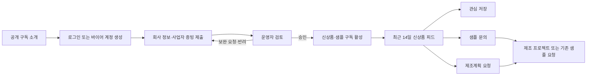

# KERYX 제조실행 플랫폼: 승인 바이어 전용 신상품·샘플 구독 통합 개편안

**작성일:** 2026-08-31
**작성자:** Manus AI
**문서 상태:** 구현 전 사업·데이터·UI 승인용
**적용 원칙:** 기존 B2B·소매·IP·구독 데이터를 삭제하거나 덮어쓰지 않고, 신규 구조를 추가하여 점진 전환한다.

---

## 1. 결론

KERYX의 `샘플 구독`은 일반 공개 뉴스레터가 아니라, **회사 정보를 완료하고 KERYX의 바이어 승인까지 받은 기업만 이용할 수 있는 신상품·샘플 정보 서비스**로 정의하는 것이 맞습니다. 승인된 바이어는 자기 관심 카테고리와 IP를 기준으로 최근에 KERYX가 검토·승인한 신상품 및 샘플 정보를 계속 볼 수 있으며, 게시 시점으로부터 **14일이 지난 항목은 구독 피드에서 자동으로 사라집니다**.

> **서비스 정의:** “검증된 바이어에게만, 최근 14일 이내의 검토된 신상품과 샘플 정보를 제공하고 제조 프로젝트로 연결하는 B2B 발견 서비스.”

이는 기존 제조실행 플랫폼의 `DISCOVER` 기능을 가장 먼저 실용화하는 방식입니다. 바이어는 매번 시장을 찾지 않아도 신상품을 확인하고 저장·샘플 요청·제조계획 요청으로 연결할 수 있습니다. 공장은 광고성 게시물을 무제한 노출하지 않으며, KERYX 운영팀이 표준 정보와 샘플 가능 여부를 검토한 항목만 바이어에게 노출합니다.[1]

| 구분 | 확정 방향 | 제외 사항 |
|---|---|---|
| 이용자 | 회사 정보가 완전하고 운영자 승인을 받은 바이어 계정 | 비로그인 방문자, 개인 계정, 승인 대기·반려·해지 계정 |
| 콘텐츠 | 운영 검토 완료된 신상품·샘플·신규 원단·부자재·제조 아이디어 | 검토 전 공장 광고, 다른 공장 견적, 바이어 원본 디자인 |
| 열람 기간 | `published_at`부터 정확히 **14일** | 단순 UI 숨김, 수동 삭제, 임의 재게시 |
| 연결 행동 | 관심 저장, 샘플 문의, 제조계획 요청, 프로젝트 생성 | 공장 연락처 공개, 자동 발주, 자동 가격 확정 |
| 알림 | 수신 동의한 승인 바이어에게 최근 항목 안내 | 동의 없는 광고성 발송, 발송 실패를 성공으로 처리 |
| 결제 | 현재는 **승인형 접근 서비스**이며 유료 정기결제와 분리 | 토스 정기결제·빌링키·유료 플랜의 자동 도입 |

---

## 2. 현재 기반과 반드시 보완할 지점

현재 KERYX에는 공개 `/sample-subscription` 신청 화면, `b2b_subscribers` 구독자·승인 상태, 관리자 구독자 검토 화면, 승인 구독자 대상 주간 안내 발송 이력이 이미 존재합니다.[2][3][4] 따라서 새 서비스를 처음부터 다시 만들 필요는 없습니다. 다만 현재 구조는 **이메일·회사명만으로 신청이 가능하고, 승인된 이메일 구독자라는 상태가 로그인한 바이어 계정 및 회사 검증과 직접 연결되지 않습니다.** 또한 신상품 피드와 14일 노출 기간을 보장하는 데이터 구조가 없습니다.[2][5]

| 현재 기반 | 재사용 방법 | 보완 필요 |
|---|---|---|
| `b2b_subscribers` | 관심 IP·관심 카테고리·수신 동의·발송 이력의 기반으로 유지 | 접근 권한의 유일한 근거로 쓰지 않고 바이어 회사 검증과 연결 |
| 관리자 `/admin/b2b-subscribers` | 승인 대기·반려·수신 해지 목록과 관심 항목 UI를 재사용 | 회사 증빙 확인, 계정 연결, 운영자 승인 API, 감사 이력 추가 |
| `/api/subscribe/b2b` | 신청 정보 검증·중복 처리의 기반으로 재사용 | 로그인 강제, 회사 검증 정보 저장, 승인 바이어 여부 검증 추가 |
| 주간 안내 API | 승인 수신자·발송 이력 테이블을 재사용 | 14일 유효 항목과 관심사 기반으로 발송 내용을 서버에서 생성 |
| 기존 `sellers` 승인 흐름 | 바이어 계정의 기본 사업자 승인 상태로 활용 | 회사 증빙·구독 접근 상태의 단일 진실과 연결, `role`/`kind` 기준 통일 |
| IP·상품·샘플 데이터 | 콘텐츠 카드의 참조 대상 | 신상품 피드용 별도 게시·검토·만료 메타데이터 추가 |

특히 기존 일부 레거시 경로는 `user_profiles.role`을, 최신 운영 API와 RLS는 `user_profiles.kind`를 권한 근거로 사용합니다. 구현 시작 전에 구독과 바이어 승인을 포함한 신규 API는 **현재 운영 기준인 `kind`와 공통 `requireAdmin` 검사만 사용**하도록 통일해야 합니다. 이 정비는 계정·비밀번호·기존 권한을 바꾸는 작업이 아니라, 신규 경로의 판정 기준을 일관되게 만드는 최소 보완입니다.

---

## 3. 최종 사업 운영 모델

### 3.1 공개 소개와 실제 구독 접근의 분리

`/sample-subscription`은 누구나 볼 수 있는 서비스 소개·신청 진입 페이지로 유지합니다. 그러나 실제 신상품·샘플 카드, 이미지, MOQ·예상 단가·샘플 가능 여부 같은 상세 정보는 공개하지 않습니다. 비로그인 방문자는 서비스 목적, 승인 절차, 취급 카테고리, 개인정보 처리 안내만 확인할 수 있습니다.

바이어가 로그인하고 회사 정보와 증빙을 모두 제출하면 `검토 대기` 상태가 됩니다. 운영자가 확인·승인한 바이어만 피드에 접근합니다. 승인 대기·반려 상태에서는 콘텐츠의 제목·이미지·공장 정보가 보이지 않으며, 본인의 누락 정보 또는 반려 사유와 재제출 버튼만 확인할 수 있습니다.

### 3.2 승인 바이어 정의

신상품 피드 접근은 다음 네 조건을 모두 만족할 때만 허용합니다.

| 순서 | 요건 | 시스템 판정 |
|---|---|---|
| 1 | 인증된 KERYX 바이어 계정 | `auth.uid()`가 바이어 프로필 및 `seller` 엔터티와 연결됨 |
| 2 | 회사 정보 완결 | 회사명, 사업자등록번호, 사업자등록증, 담당자, 연락처, 업무 이메일, 사업장 주소, 업종·관심 카테고리, 필수 동의가 유효 |
| 3 | 회사 검증 승인 | 운영자가 증빙을 확인하고 `approved` 결정 및 승인 이력을 저장 |
| 4 | 구독 접근 활성 | 신상품 피드 접근 상태가 `active`, 계정·회사 정보가 재검증 대기·반려·정지 상태가 아님 |

사업자등록번호, 사업자등록증 파일, 회사명처럼 검증의 근거가 되는 값이 변경되면 시스템은 접근 상태를 자동으로 `reverification_required`로 바꾸고, 새 승인 전까지 피드 접근을 중지합니다. 반면 관심 IP·관심 카테고리·수신 채널 변경은 재승인 없이 즉시 반영됩니다.

### 3.3 구독과 이메일 동의의 분리

`구독 접근`과 `마케팅 수신 동의`는 법적·운영상 분리합니다. 승인 바이어는 수신 동의를 철회해도 포털에 로그인하여 최근 신상품 피드를 볼 수 있습니다. 단, 이메일·알림톡·문자 알림은 해당 채널의 명시적 수신 동의가 있을 때만 발송합니다. 이 구조는 사용자의 정보 접근권을 지키면서 불필요한 광고성 발송을 막습니다.

### 3.4 최근 14일 정책

신상품 피드는 화면에서만 숨기는 방식이 아니라 서버의 안전한 뷰와 API에서 시간 조건을 강제합니다.

```text
표시 조건 = 검토 승인 완료
          AND 게시 시작 시각 <= 현재 시각
          AND 현재 시각 < 게시 시작 시각 + 14일
          AND 게시 상태 = published
          AND 바이어 회사 검증·구독 접근 = active
```

`14일`은 게시 시작 시각을 기준으로 한 정확한 기간입니다. 예를 들어 오전에 게시된 항목은 14일 후 같은 시각에 피드에서 제외됩니다. 제외된 항목은 DB에서 삭제하지 않고 `expired` 또는 `archived` 상태로 보관하므로, 운영자·감사 이력·기존 메일 기록·저장 통계는 유지됩니다.

재게시가 필요한 경우 운영자는 기존 행의 `published_at`을 덮어쓰지 않습니다. `reissue_reason`과 새 검토 승인 행을 만들고, 동일 제품의 반복 노출 여부를 감사 이력에 남깁니다. 이 규칙은 오래된 상품이 단순 날짜 갱신으로 계속 신상품처럼 보이는 문제를 막습니다.

---

## 4. 바이어 경험과 화면 설계

### 4.1 최종 이용 흐름



### 4.2 공개 및 바이어 화면

| 주소 | 접근 | 최종 UI와 행동 |
|---|---|---|
| `/sample-subscription` | 공개 | 서비스 안내, 승인 절차, 취급 카테고리, 로그인·회사 인증 시작 CTA. 실제 신상품 카드는 노출하지 않음 |
| `/sample-subscription/apply` | 로그인 바이어 | 회사 정보·사업자등록증·관심 IP·관심 카테고리·필수 동의 입력, 제출 후 검토 상태 표시 |
| `/sample-subscription/status` | 본인 | 검토 대기·보완 요청·승인·반려·재검증 대기 상태, 누락 항목, 재제출, 수신 설정 |
| `/buyer/discover` | 승인 + 구독 활성 바이어 | 최근 14일 신상품·샘플 피드, 관심도 필터, 샘플 가능 여부, 저장·문의·제조계획 CTA |
| `/buyer/discover/[id]` | 승인 + 구독 활성 바이어 | 제품 이미지, 카테고리, 사이즈, MOQ 범위, 예상 기간, 샘플 가능 여부, 변형 가능 범위, KERYX 검토 메모. 공장 원가·마진·타 공장 정보 미노출 |
| `/buyer/ideas` | 승인 + 구독 활성 바이어 | 저장한 신상품·샘플·제조 아이디어, 저장 당시 상태, 프로젝트 생성 연결 |
| `/buyer/projects/new?source=offering&id=...` | 승인 바이어 | 피드 항목의 정보 일부를 제조 요청 초안으로 복사. 새 프로젝트는 독립 데이터로 생성 |

바이어 피드는 카드형 정보 구조로 구현합니다. 카드 상단은 새 항목의 이미지와 카테고리, 중앙은 `샘플 가능`, `변형 가능`, `관심 카테고리 일치` 같은 검증된 태그, 하단은 `관심 저장`, `샘플 문의`, `제조계획 요청` 행동만 보여줍니다. 수량·가격·납기 숫자는 운영자가 실제 입력하고 공개 대상으로 승인한 값만 표시합니다. 데이터가 없을 때 가짜 가격·샘플·재고를 만들지 않습니다.

이미지는 목록용 압축 썸네일과 상세용 표시 이미지로 분리하며, 원본 도면·고해상도 QC 파일·공장 내부 문서는 바이어 피드에 노출하지 않습니다. 이미지·파일 접근은 만료형 서명 URL과 프로젝트·구독 권한을 함께 확인합니다.

### 4.3 상태별 빈 화면과 안내

| 사용자 상태 | 보여줄 화면 | 노출 금지 |
|---|---|---|
| 비로그인 | 소개, 승인형 서비스 설명, 로그인·신청 CTA | 상품 카드·샘플 이미지·상세 조건 |
| 회사 정보 미완료 | 완료해야 할 회사 정보 목록, 임시저장·제출 | 피드·카드·알림 구독 시작 |
| 검토 대기 | 제출 정보 요약, 검토 중 안내, 수정·재제출 | 피드·샘플·가격 |
| 보완 요청 | 필요한 항목과 운영자 안내, 보완 제출 | 피드·기존 승인 상태의 재활성화 |
| 반려 | 반려 사유, 문의·재신청 정책 | 피드·자동 재승인 |
| 승인·활성 | 최근 14일 피드, 관심 설정, 수신 설정 | 만료된 항목의 일반 목록 |
| 수신 해지 | 알림 수신 재개 옵션, 피드 접근은 유지 | 강제 이메일·문자 발송 |
| 재검증 대기 | 변경된 회사 정보 검토 안내 | 피드·샘플 상세 접근 |

모든 화면은 한국어/중국어 전환을 지원합니다. 공개 사이트의 기존 헤더·푸터는 유지하며, 로그인 바이어 화면에서는 `내 제조 프로젝트`, `신상품·샘플`, `내 아이디어`, `문의·알림 설정`을 우선순위 메뉴로 보입니다.

---

## 5. 운영자·공장 운영 화면

### 5.1 운영자 화면

현재 `/admin/b2b-subscribers`는 검토 기반으로 유지하되, 브라우저에서 직접 테이블을 업데이트하는 방식은 새 승인 API로 교체합니다. 승인·반려·보완 요청은 서버에서 관리자 권한, 회사 정보 완결성, 파일 존재, 변경 이력을 검증합니다.

| 주소 | 최종 기능 |
|---|---|
| `/admin/buyer-verifications` | 회사 정보·사업자등록증 검토, 승인·보완 요청·반려, 승인자·사유·시각·증빙 확인 |
| `/admin/new-product-feed` | 신규 콘텐츠 초안, 공장 제출 검토, 이미지·상품·샘플 연결, 관심 카테고리, 게시 예약, 14일 만료 시각, 승인·반려 |
| `/admin/new-product-feed/[id]` | 카드 미리보기, 공개 필드 검토, 수신 대상 미리보기, 재게시 사유·승인 이력 |
| `/admin/b2b-subscribers` | 수신 채널·관심 카테고리·수신 해지·발송 이력 중심으로 역할 재정의 |
| `/admin/subscription-deliveries` | 생성된 안내, 수신자, 항목 목록, 성공·실패·반송, 재발송·중지 이력 |
| `/admin/operator-activity` | 회사 검증·콘텐츠 승인·게시·만료·재발행·열람·수신 설정 변경의 감사 로그 |

운영자는 신상품을 직접 등록하거나 공장이 표준 양식으로 제출한 항목을 검토합니다. 공장 제출 후 바이어 피드에 즉시 노출되지 않으며 `draft → submitted → revision_requested / approved → published → expired / archived` 상태를 가집니다.

### 5.2 공장 화면

공장에게는 `신상품 제안` 메뉴를 제공할 수 있으나, 이는 공개 게시판이 아닙니다. 공장은 제품 이미지, 카테고리, 대략적 크기, MOQ, 샘플 보유 여부, 생산 가능 기간, 특징, 변형 가능 범위만 표준 양식으로 제출합니다. 다른 공장의 제품·견적·노출 성과, 바이어의 회사명·관심사·판매가, KERYX의 마진은 볼 수 없습니다.

| 공장 상태 | 공장 화면 | 바이어 피드 |
|---|---|---|
| 초안 | 본인만 열람·수정 | 미노출 |
| 제출됨 | 검토 대기·보완 요청 확인 | 미노출 |
| 보완 요청 | 수정·재제출 | 미노출 |
| 승인·게시됨 | 게시 기간·검토 메모 확인 | 승인 바이어에게만 노출 |
| 만료 | 과거 제출 이력 확인 | 피드에서 자동 제외 |

---

## 6. 데이터·권한·API 최종 설계

### 6.1 데이터 구조: 기존 데이터 보존

`b2b_subscribers`와 기존 `sellers` 레코드는 유지합니다. 이미 승인된 구독자에게는 자동 열람 권한을 부여하지 않습니다. 이유는 기존 레코드에 로그인 바이어 계정, 사업자등록증, 회사 검증 상태가 모두 연결되어 있지 않을 수 있기 때문입니다. 기존 레코드는 `legacy` 출처로 보존하고, 최초 로그인 시 계정 연결·회사 정보 보완·재검증을 거친 뒤 새 접근 상태로 전환합니다.

| 테이블 | 목적 | 핵심 열·규칙 |
|---|---|---|
| `buyer_company_verifications` | 바이어 회사 검증의 단일 진실 | `seller_id`, `user_id`, 회사 정보 스냅샷, 등록번호, 증빙 파일 경로, `status`, 승인자·사유·시각, 재검증 사유 |
| `buyer_subscription_access` | 피드 접근·수신 설정 | `verification_id`, `subscriber_id`, `feed_access_status`, 관심 카테고리·IP, 이메일/알림 동의, 활성·해지·정지 시각 |
| `buyer_verification_events` | 회사 정보·승인 감사 | 행 추가 방식, actor, 이전·다음 상태, 사유, 민감정보 노출 없는 변경 요약 |
| `new_product_offerings` | 신상품 피드의 표준 게시 단위 | 소스 유형, 카테고리, 공개 제목·설명, `published_at`, `expires_at`, 게시 상태, 검토자, 재게시 사유 |
| `new_product_offering_assets` | 목록·상세 이미지와 샘플 자료 | 공개 등급, 스토리지 경로, 이미지 순서, 원본·표시용 구분 |
| `new_product_offering_samples` | 샘플 가능 정보·문의 연결 | 샘플 가능 여부, 요청 정책, 기존 `sample_requests` 참조 |
| `new_product_offering_reviews` | 공장·운영자 콘텐츠 검토 | 제출자, 검토자, 결정, 보완·반려 사유, 불변 이력 |
| `buyer_offering_views` | 피드 열람·저장·전환 분석 | 바이어/회사 ID, offering ID, 이벤트 타입, 시각. 개인·IP 원본 데이터 미저장 |
| `subscription_delivery_runs` | 정기 안내의 생성·발송 단위 | 항목 스냅샷, 발송 조건, 생성자, 결과 집계, 외부 제공자 메시지 ID |
| `subscription_delivery_recipients` | 수신자별 결과 | 수신 동의·자격 스냅샷, 전달 상태, 실패 원인, 수신 거부 처리 |

`new_product_offerings`의 `expires_at`은 `published_at + 14일`로 DB에서 계산·검증합니다. 운영자 UI는 만료 시각을 표시만 하며, 임의 값을 입력해 연장하지 못하게 합니다. 기간 변경이 사업적으로 필요하면 정책 버전과 승인 이력을 남기는 별도 변경 절차로만 처리합니다.

### 6.2 RLS와 안전한 뷰

| 대상 | 바이어 권한 | 공장 권한 | 내부 권한 |
|---|---|---|---|
| 회사 검증 원문·증빙 | 자기 회사만, 필요한 최소 필드 | 접근 불가 | admin/권한 부여 MD만, 원문 열람 감사 |
| 신상품 피드 | 승인 + 활성 구독 상태일 때만 유효 14일 항목 | 자기 제출 항목의 상태만 | admin/권한 부여 MD 전부 |
| 공장 제안 원문 | 접근 불가 | 자기 행만 | 검토 담당자 |
| 공장 원가·마진 | 접근 불가 | 접근 불가 | 총책임자·권한 부여 MD만 |
| 관심·열람 분석 | 자기 저장 항목만 | 타 바이어 데이터 접근 불가 | 집계·권한 범위 내 조회 |
| 발송 이력 | 본인 수신 상태만 | 접근 불가 | 관리자·마케팅 권한 |

바이어 피드는 `v_approved_buyer_new_product_feed` 같은 **보안 뷰**를 통해서만 읽습니다. 이 뷰는 로그인한 사용자의 회사·검증·접근 상태와 게시·만료 시간을 함께 검사합니다. 페이지나 프론트엔드 배열에서 14일 조건을 처리하지 않습니다. 이를 통해 URL 직접 호출, 브라우저 개발자 도구, 캐시된 응답으로 만료·비승인 콘텐츠를 보는 문제를 방지합니다.

### 6.3 API 설계

| API | 사용자 | 목적 | 핵심 보호 |
|---|---|---|---|
| `POST /api/buyer/company-verification` | 로그인 바이어 | 회사 정보·증빙 제출/수정 | 본인 회사만, 필수 필드 검증, private 파일 경로 |
| `GET /api/buyer/company-verification` | 로그인 바이어 | 본인 검토 상태·보완사항 | 민감 원문 최소 반환 |
| `GET /api/buyer/discover` | 승인·활성 바이어 | 최근 14일 피드 목록 | 서버·뷰에서 14일과 구독 자격 강제 |
| `GET /api/buyer/discover/[id]` | 승인·활성 바이어 | 유효 항목 상세 | 만료·미승인·비공개 항목은 404 또는 권한 없음 |
| `POST /api/buyer/discover/[id]/save` | 승인·활성 바이어 | 관심 저장 | 본인 회사 범위, 이벤트 기록 |
| `POST /api/buyer/discover/[id]/request-plan` | 승인 바이어 | 제조 프로젝트 초안 생성 | offering 값은 복사 스냅샷, 원본 디자인 혼합 금지 |
| `POST /api/factory/new-offerings` | 공장 | 신상품 제안 제출 | 표준 필드·자기 공장 범위·검토 전 비공개 |
| `POST /api/admin/buyer-verifications/[id]/decision` | admin | 승인·보완·반려 | `requireAdmin`, 동일인 승인 제한, 사유·감사 로그 |
| `POST /api/admin/new-product-offerings/[id]/publish` | admin | 검토 승인·게시 | 모든 공개 필드 확인, 14일 만료 자동 설정, 감사 로그 |
| `POST /api/admin/subscription-deliveries/preview` | admin/marketing | 수신 대상·항목 사전 확인 | 활성 승인 바이어·수신 동의·14일 항목만 계산 |
| `POST /api/admin/subscription-deliveries/send` | admin/marketing | 실제 발송 | 미리보기 토큰·권한·수신 거부·발송 이력·실제 제공자 결과 확인 |

### 6.4 알림·메일링 자동화

신상품 발송은 먼저 `발송 미리보기`를 생성합니다. 미리보기에는 실제 수신 자격이 있는 바이어 수, 수신 동의 현황, 14일 안에 유효한 콘텐츠 수, 카테고리 매칭 결과를 표시합니다. 운영자가 이를 확인한 뒤에만 발송합니다. 자동화가 필요한 이후 단계에서는 새 항목 게시 시 관심 카테고리가 일치하고 수신 동의가 있는 바이어에게만 중복 방지 키로 안내를 생성합니다.

현재 주간 발송 API는 발송 제공자 키가 없는 경우에도 성공으로 기록하는 경로가 있으므로, 새 설계에서는 이를 유지하지 않습니다. 발송 제공자 호출이 실제로 이루어졌고 제공자 응답이 성공일 때만 `sent` 또는 `delivered`로 기록합니다. 키가 없거나 외부 연동이 비활성인 환경에서는 `not_sent` 또는 `simulation`으로 분리해 실제 발송 성공으로 집계하지 않습니다.

외부 메일·알림·물류·결제 API를 새로 연결하거나 현재 연결 방식을 바꿀 때마다 다음 보고서를 프로젝트 문서에 추가합니다.

| 기록 항목 | 필수 내용 |
|---|---|
| 연동명·목적 | 어떤 서비스에 어떤 업무를 맡기는지 |
| 데이터 흐름 | 전송 필드, 수신 필드, 저장 위치, 민감정보 여부 |
| 권한·비밀정보 | 환경변수 이름만 기록, 키·토큰 원문 기록 금지 |
| 실패·재시도 | 실패 상태, 중복 방지, 알림, 수동 복구 방법 |
| 변경 이력 | 변경일, 담당자, Preview·Production 테스트 결과 |

---

## 7. 사이트맵과 메뉴 변경안

새 경로는 기존 공개 IP·스토어·샘플 구독과 기존 바이어 포털을 삭제하지 않고 추가합니다. 모든 경로는 `sitemap.yaml v3`, `src/config/navigation.ts`, 미들웨어 공개 예외, 역할별 layout, API 권한 테스트 목록에 동시에 기록합니다.

| 영역 | 추가/수정 주소 | 접근 정책 |
|---|---|---|
| 공개 | `/sample-subscription` | 공개 소개·신청 시작 |
| 바이어 신청 | `/sample-subscription/apply`, `/sample-subscription/status` | 로그인한 본인만 |
| 바이어 피드 | `/buyer/discover`, `/buyer/discover/[id]`, `/buyer/ideas` | 승인된 회사 + 활성 구독만 |
| 바이어 제조 연결 | `/buyer/projects/new?source=offering&id=...` | 승인 바이어, 피드 유효 항목만 참조 |
| 공장 | `/factory/new-offerings` | 해당 공장 본인만 |
| 운영자 | `/admin/buyer-verifications`, `/admin/new-product-feed`, `/admin/subscription-deliveries` | admin/권한 부여 marketing만 |
| 기존 | `/admin/b2b-subscribers`, `/admin/weekly-report` | 삭제하지 않고 수신 설정·과거 이력 관리로 재정렬 |

공개 상단 메뉴에는 `샘플 구독`을 유지합니다. 바이어 로그인 후에는 동일 메뉴가 권한에 따라 `신상품·샘플` 피드 또는 회사 검증 화면으로 연결됩니다. 이 방식은 공개 방문자에게는 이해하기 쉬운 한 개의 진입점, 승인 바이어에게는 즉시 사용할 수 있는 업무 경로를 제공합니다.

---

## 8. 구현 순서와 승인 게이트

### Phase 0 — 데이터·권한 진단 및 기반 정비

기존 `sellers`, `b2b_subscribers`, 사업자 증빙 스토리지, 승인 API, `user_profiles.kind`의 실제 운영 상태를 Production과 안전하게 대조합니다. 신규 테이블·RLS·보안 뷰·트리거·이벤트 로그·14일 정책의 SQL을 작성하고, 기존 구독자 데이터의 `legacy` 전환 규칙을 정의합니다. 이 단계에서는 기존 구독자, 바이어, 상품, 주문 데이터를 삭제하거나 대량 수정하지 않습니다.

**대표 승인 필요:** 회사 정보 필수 항목, 사업자등록증 보관 기간, 반려·재검증 정책, 기존 승인 구독자의 재인증 방법, 개인정보 처리·수신 동의 문구, 새 SQL 전체.

### Phase 1 — 승인 바이어 구독 게이트와 최근 14일 피드

로그인 기반 회사 정보 입력, 사업자 증빙 업로드, 운영자 승인·보완·반려, `active` 구독 접근, 최근 14일 안전 피드, 관심 저장, 상태별 빈 화면을 구현합니다. 기존 공개 신청 폼과 B2B 구독 이력은 유지하되 신규 신청은 로그인·회사 검증 흐름으로 이동합니다.

**완료 기준:** 승인되지 않은 계정이 URL·API를 직접 호출해도 피드·이미지·조건을 읽지 못하고, 승인 바이어는 실제로 승인된 유효 항목만 확인하며, 게시 14일 경과 후 API·화면·메일 후보에서 동시에 제외됩니다.

### Phase 2 — 공장 신상품 제출·운영 검토·샘플 연결

공장 표준 제출 양식, 운영자 콘텐츠 검토, 공개 필드 제한, 게시 예약·만료, 샘플 가능 정보, 기존 샘플 요청·제조 프로젝트 연결을 구현합니다.

**완료 기준:** 공장이 자기 제안만 관리하고, 검토 전 항목은 어떤 바이어에게도 노출되지 않으며, 운영자 게시·반려·재게시 사유가 활동 이력에 남습니다.

### Phase 3 — 맞춤 안내·발송 이력·제조 전환 분석

관심 카테고리·IP 기반 발송 미리보기, 승인 바이어·수신 동의 필터, 실제 전송 결과 처리, 관심 저장→샘플 문의→제조 프로젝트 전환 기록을 구현합니다. 외부 발송 제공자 설정은 별도 승인과 Preview 테스트를 통과한 뒤에만 활성화합니다.

**완료 기준:** 동의 없는 수신자·만료 항목·반려 바이어에게는 발송되지 않고, 실패 건이 성공으로 집계되지 않으며, 운영자는 콘텐츠별 전환을 익명·권한 범위에서 확인합니다.

### Phase 4 — 제조실행 플랫폼 전체와 통합

이전 계획의 바이어 프로젝트 룸, RFQ·견적, 샘플 버전, 골든샘플 잠금, 양산·QC·배송·재주문을 완성합니다. 신상품 피드의 `제조계획 요청`은 이 단계에서 완전한 프로젝트 생성 워크플로로 연결됩니다.[1]

---

## 9. 구현 전 확인이 필요한 최종 의사결정

| 승인 항목 | 권장안 | 이유 |
|---|---|---|
| 구독의 성격 | 무료·승인형 B2B 신상품 정보 접근 | 현재 목표가 결제가 아닌 검증 바이어 확보이기 때문 |
| 14일 기준 | 게시 시작 시각부터 정확히 14일, 서버·DB에서 강제 | 화면 캐시·URL 우회·수동 누락 방지 |
| 회사 정보 | 회사명, 사업자등록번호, 사업자등록증, 담당자, 연락처, 이메일, 주소, 업종·관심 항목, 필수 동의 | 바이어 실체와 구독 목적을 함께 검토 |
| 기존 구독자 | 삭제하지 않고 `legacy` 이력 보존, 로그인·회사 검증 후 활성화 | 과거 데이터 보존과 무심사 열람 방지 |
| 피드 콘텐츠 | 운영 검토된 공장 신상품·KERYX 신상품·샘플 정보 | 광고성·저품질·미검증 콘텐츠 차단 |
| 재게시 | 기존 게시 수정 금지, 사유와 새 승인으로만 재발행 | 신상품 기간을 임의로 연장하는 문제 방지 |
| 이메일 알림 | 포털 접근과 분리; 수신 동의 바이어에게만 실제 성공 결과 확인 후 발송 | 개인정보·발송 정확성 보호 |
| 비용·결제 | 현 단계 미도입, 토스 정기결제는 별도 사업 승인 후 검토 | 구독 접근 기능의 복잡도·비용·법적 범위 통제 |

---

## 10. 데이터 아키텍처 검증 기준

이 문서는 구현 전 설계입니다. 실제 SQL과 코드 배포 전·후에는 아래 검증을 필수로 수행합니다.

```text
## Data Architecture Verification
- RLS policies in effect on touched tables: 설계 단계 / 구현 후 검증
- Cost data not exposed to non-owner roles: 설계상 분리 / 구현 후 API 필드 검증
- Approval workflow followed for record creation/modification: 설계상 필수 / 구현 후 상태 전이 검증
- Inventory integrity check passed: 본 기능 범위 N/A, 제조 프로젝트 단계에서 적용
- Tier-based pricing applied via canonical function: 본 기능 범위 N/A, 유료 구독 도입 시 적용
- Relationship changes logged to audit table: 설계상 필수 / 구현 후 감사 로그 검증
```

---

## 11. 최종 판단

이번 추가 요구는 단순히 신상품 카드에 `14일 후 숨김`을 넣는 기능이 아닙니다. KERYX가 공장 광고를 노출하는 사이트가 아니라, **검증된 바이어에게 검토된 제조 기회를 제공하고 실제 제조 프로젝트로 전환하는 운영 시스템**이 되기 위한 핵심 진입점입니다.

따라서 우선은 `Phase 0 + Phase 1`만 분리하여 진행하는 것이 가장 안전합니다. 먼저 기존 바이어 승인 데이터와 구독자 이력을 연결하고, 최근 14일 정책을 DB·API에서 강제한 뒤, 실제 승인 바이어가 신상품을 보고 제조계획을 요청하는 흐름을 검증합니다. 이후 공장 제출·메일링·전체 제조 프로젝트 룸을 순차 통합해야 기존 Production의 IP·스토어·주문·구독 기능을 훼손하지 않습니다.

---

## 참고자료

[1]: ../../../upload/KERYX제조실행플랫폼통합작업계획서.md "사용자 첨부: KERYX 제조실행 플랫폼 통합 작업계획서"
[2]: ../../src/components/sample/SampleSubscriptionForm.tsx "현재 공개 샘플 구독 신청 UI"
[3]: ../../src/app/api/subscribe/b2b/route.ts "현재 B2B 구독 신청 API"
[4]: ../../src/app/admin/b2b-subscribers/page.tsx "현재 구독자 검토 UI"
[5]: ../../supabase/migrations/20260803_b2b_subscribers.sql "기존 B2B 구독·발송 이력 스키마"
[6]: ../../supabase/migrations/20260828_retail_commerce_toss_samples.sql "기존 소매·샘플 구독 확장 및 현행 kind 기준 정책"
[7]: ../../src/app/api/admin/weekly-report/route.ts "현재 주간 발송 API"
[8]: ../../skills/trade-data-architecture/SKILL.md "무역 데이터 격리·승인·무결성 기준"
[9]: ../../skills/subscription-membership-system/SKILL.md "구독 접근·동의·결제 분리 원칙"

> **중요:** 이 문서는 기획·설계 문서이며, 계정·비밀번호·권한·환경변수·외부 API·Production DB를 변경하지 않습니다. 구현 시작 전에는 Phase 0의 상세 SQL, RLS, 스토리지 정책, 경로 매트릭스를 대표 승인용으로 별도 제시합니다.
